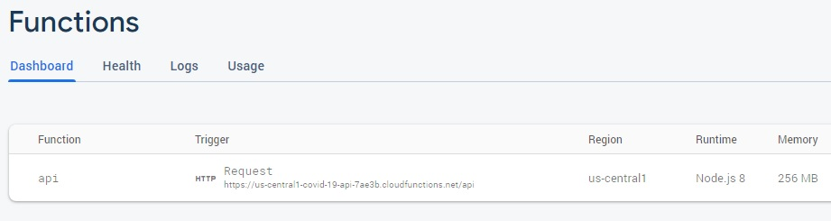
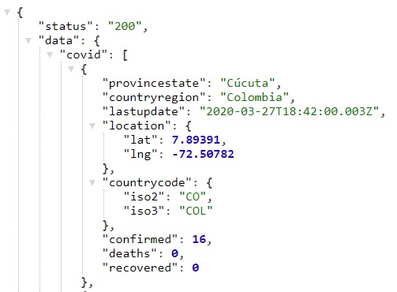

# firebase-api-covid-19

¿How does that work?

Require Node.js 8.x

* Create project in [firebase](https://console.firebase.google.com/)
* `npm install -g firebase-tools`
* `firebase login`
* `firebase init functions` for a new project
* `npm install` to install the dependencies
* `npm run serve` to run development mode app
* `npm run deploy` to build production

# Endpoints
[/api](https://us-central1-covid-19-api-7ae3b.cloudfunctions.net/api) -> get data json

[/api/test](https://us-central1-covid-19-api-7ae3b.cloudfunctions.net/api/test) -> get message 

----

# Docs Firebase

[Documentation Firebase by platform](https://firebase.google.com/docs?hl=es)

[Firebase web](https://firebase.google.com/docs/web/setup?hl=es)

[Firebase functions](https://firebase.google.com/docs/functions)
